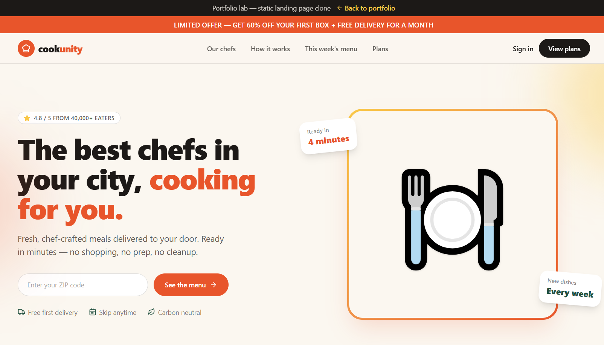

# lab-cookunity


A pixel-inspired, fully static DTC meal-delivery landing page built to study high-converting layouts.

## Tech stack

`Next.js` · `TypeScript` · `Tailwind CSS v4` · `fully static — no backend`

## Features

- Sticky navigation with announcement + demo bars
- Hero with ZIP-code capture and social-proof rating
- Chef carousel / grid of local chefs
- "This week's menu" grid with dietary filter chips
- Plans & pricing with a highlighted "Most popular" tier
- Testimonials wall
- FAQ accordion (native `<details>`)

No API keys, environment secrets, or backend required — everything renders statically.

## Getting started

```bash
git clone https://github.com/metz97/lab-cookunity.git
cd lab-cookunity
npm install
npm run dev
```

Then open [http://localhost:3000](http://localhost:3000).

## Testing

A jsdom render smoke test (Vitest + React Testing Library) asserts the hero heading, primary CTA, plans section, and back-to-portfolio link render:

```bash
npm run test
```

Other useful scripts: `npm run lint`, `npm run typecheck`, `npm run build`.



## Part of my portfolio

This is one of my portfolio labs. See the rest of my work at [https://khalidahmad.dev](https://khalidahmad.dev).

The only (optional) configuration is `NEXT_PUBLIC_PORTFOLIO_URL`, which points the "Back to portfolio" link at your main site. Copy `.env.example` to `.env` to set it. This app needs no API keys.
